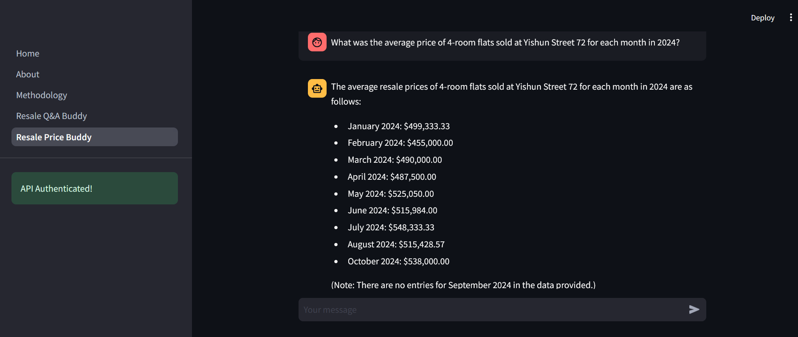

# HDB Resale Buddy

An AI-Assistant for HDB resale buying enquiries with two use cases:

#### Resale Q&A Buddy
For general queries related to buying a resale HDB flat in Singapore. Official HDB webpages used
for building the knowledge-base can be viewed in `scrape_create-vectordb.py`.

#### Resale Price Buddy
For querying resale transaction price data for HDB flats in Singapore, based on data from 2017 onwards sourced from [data.gov.sg](https://data.gov.sg). 

## Quick Access

The application is deployed on Streamlit Community Cloud [here](https://hdb-resale-buddy.streamlit.app/). You will need your own OpenAI API Key to use the application.

## Framework

This chatbot is powered by the [LangChain](https://python.langchain.com/) and [LangGraph](https://www.langchain.com/langgraph) Python frameworks. GUI developed via [Streamlit](https://streamlit.io/).

## License

This project is licensed under the MIT License. See [LICENSE](LICENSE) for more information.
